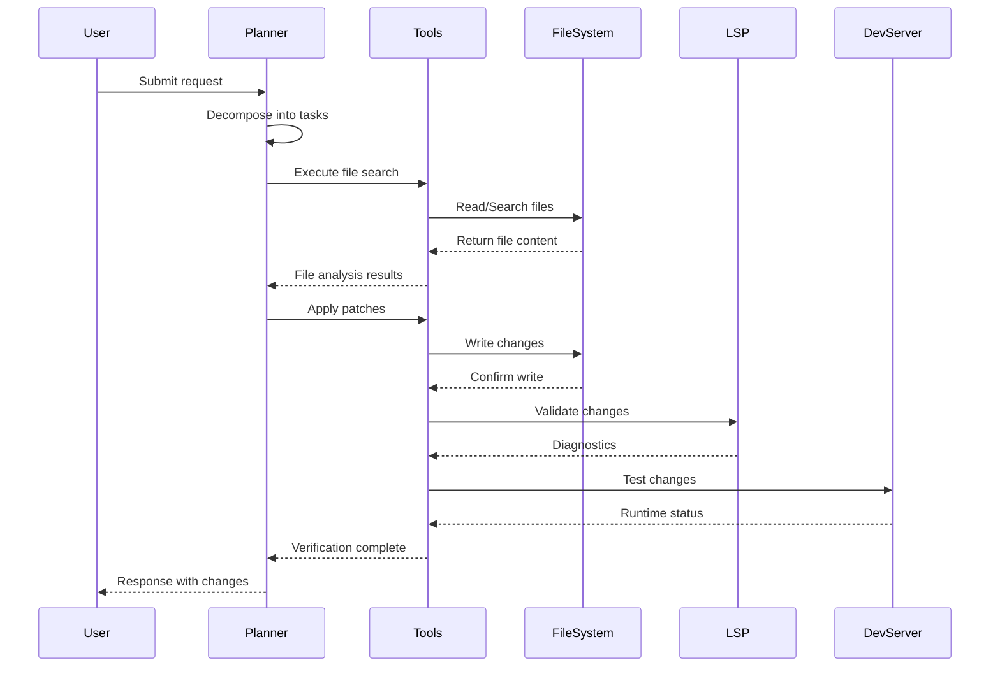
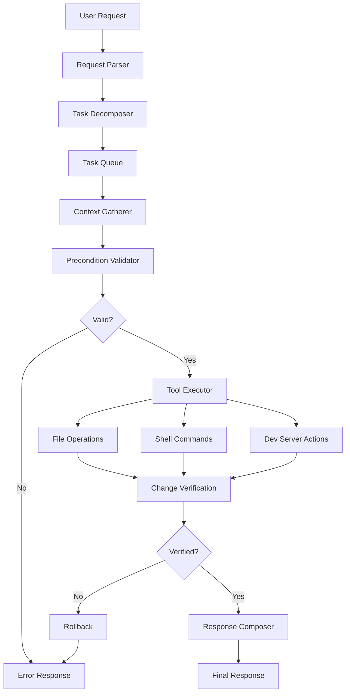

# SOL-210: Replit AI Assistant Architecture & Workflow Analysis

## 1. High-Level Architecture

### Core Components

1. **Agent Core** - Main orchestrator handling user requests
2. **Planner** - Task decomposition and workflow planning
3. **Tools/Executors** - File operations, shell commands, diagnostics
4. **LSP/TypeScript Diagnostics** - Code analysis and error detection
5. **Run/Build Servers** - Development server management
6. **File System** - Project file access and manipulation
7. **Sandbox** - Isolated execution environment
8. **Message Queue** - Task queuing and state management
9. **Checkpoint Store** - Progress tracking and rollback capability

### Request Flow Diagram



## 2. Execution Loop (Planner/Actor)

### Main Loop Pseudocode

```javascript
async function mainExecutionLoop(userRequest) {
    // PLAN Phase
    const taskList = await decomposeTasks(userRequest);
    const checkpoint = createCheckpoint();
    
    try {
        for (const task of taskList) {
            // PROVE Phase
            const context = await gatherContext(task);
            const proof = await validatePreconditions(context);
            
            if (!proof.valid) {
                throw new TaskValidationError(proof.errors);
            }
            
            // ACT Phase
            const result = await executeTask(task, context);
            
            // VERIFY Phase
            const verification = await verifyChanges(result);
            
            if (!verification.success) {
                await rollbackToCheckpoint(checkpoint);
                throw new VerificationError(verification.errors);
            }
            
            // Update checkpoint
            updateCheckpoint(checkpoint, result);
        }
        
        // REPORT Phase
        return composeResponse(taskList, checkpoint);
        
    } catch (error) {
        await handleRecovery(error, checkpoint);
        return composeErrorResponse(error);
    }
}
```

### Task Chunking Strategy

- **Single-file scope** - Prefer atomic changes within one file
- **Dependency-aware** - Respect import/export relationships
- **Size limits** - Break down large refactors into smaller steps
- **Verification gates** - Each chunk must pass before proceeding

## 3. Task Lists, Checkpoints & Message Queue

### Checkpoint Granularity

```yaml
checkpoint_structure:
  id: "checkpoint_uuid"
  timestamp: "ISO_datetime"
  state:
    - file_changes: []
    - task_progress: {}
    - verification_results: {}
  rollback_policy:
    - auto_rollback_on_error: true
    - max_rollback_depth: 5
    - preserve_user_files: true
```

### Message Queue System

- **Follow-up tasks** - Queued automatically based on dependencies
- **Priority system** - Critical errors get immediate attention
- **Pause/Resume** - User can interrupt and continue later

## 4. Tools & Capabilities

| Tool | Inputs | Outputs | Side Effects | Failure Modes |
|------|--------|---------|--------------|---------------|
| `file_search` | query, path, extensions | file_matches[] | None | No matches, permission denied |
| `file_read` | file_path | file_content | None | File not found, binary file |
| `file_write` | path, content | success_status | File modified | Write permission, disk space |
| `strict_patch` | file_path, old_str, new_str | patch_result | Single change | String not found, ambiguous match |
| `lsp_diagnostics` | file_path | errors[], warnings[] | None | LSP unavailable, parse error |
| `run_command` | command, working_dir | stdout, stderr, exit_code | Process spawned | Command not found, timeout |
| `dev_server` | start/stop/status | server_info | Port binding | Port in use, build errors |

## 5. Editing Policies

### STRICT PATCH MODE Rules

```javascript
const STRICT_PATCH_RULES = {
    // Core Principles
    prove_before_patch: true,
    minimal_diff: true,
    single_file_scope: true,
    revert_on_failure: true,
    
    // Validation Steps
    validate_old_string: true,
    ensure_unique_match: true,
    preserve_syntax: true,
    maintain_imports: true,
    
    // Constraints
    max_lines_changed: 50,
    require_exact_match: true,
    no_whitespace_only_changes: false
};
```

### Multi-file Change Gating

1. **Justification required** - Must prove necessity
2. **Dependency mapping** - Analyze cross-file impacts
3. **Staged execution** - One file at a time
4. **Rollback chain** - Ability to revert all changes

## 6. Verification Strategy

### Proof Collection

```javascript
const verificationSteps = [
    // Syntax Verification
    async () => checkSyntax(filePath),
    
    // Type Checking
    async () => runTypeScript(filePath),
    
    // LSP Diagnostics  
    async () => getLSPErrors(filePath),
    
    // Build Test
    async () => tryBuild(project),
    
    // Runtime Test
    async () => startDevServer(project),
    
    // Integration Test
    async () => runTests(project)
];
```

### Acceptance Criteria

- ✅ No TypeScript errors
- ✅ No LSP warnings (critical)
- ✅ Successful build
- ✅ Dev server starts
- ✅ No runtime crashes
- ✅ Tests pass (if applicable)

## 7. Memory, Context & State

### Working Context Structure

```javascript
const workingContext = {
    // Session Memory
    taskHistory: [],
    fileCache: new Map(),
    diagnosticsCache: new Map(),
    
    // Limits
    maxContextTokens: 100000,
    maxFilesCached: 50,
    maxTaskHistory: 20,
    
    // Truncation Strategy
    truncationPolicy: 'oldest_first',
    preserveCriticalTasks: true
};
```

## 8. Determinism & Controls

### Model Parameters

```yaml
model_settings:
  temperature: 0.1      # Low for consistent output
  top_p: 0.95          # Balanced creativity
  max_tokens: 4000     # Response limit
  stop_sequences: ["```", "---END---"]

behavior_controls:
  terse_mode: false
  exhaustive_mode: false
  retry_count: 3
  backoff_strategy: "exponential"
```

## 9. Limits & Timeouts

### System Constraints

| Resource | Limit | Fallback |
|----------|-------|----------|
| Tool execution | 30s | Timeout & retry |
| File operations | 5s | Cancel & report |
| LSP diagnostics | 10s | Skip verification |
| Build process | 120s | Abort & rollback |
| Total request | 300s | Return partial results |

## 10. Error Handling & Recovery

### Common Error Patterns

```javascript
const errorRecoveryMap = {
    'TS2304': {
        // Cannot find name 'X'
        recovery: 'addImportStatement',
        template: 'import { {symbol} } from "{module}";'
    },
    
    'TS2307': {
        // Cannot find module
        recovery: 'installPackage',
        template: 'npm install {package}'
    },
    
    'TS2314': {
        // Generic type 'X' requires Y type arguments
        recovery: 'addTypeParameters',
        template: '{type}<{params}>'
    },
    
    'PORT_IN_USE': {
        recovery: 'findAlternativePort',
        template: 'Using port {newPort} instead of {originalPort}'
    }
};
```

## 11. Observed Endpoints & Dev Server Behavior

### Common Development Scripts

```javascript
const devServerPatterns = {
    vite: {
        command: 'npm run dev',
        port_detection: /Local:\s+http:\/\/localhost:(\d+)/,
        ready_signal: 'Local:   http://localhost',
        hmr_enabled: true
    },
    
    nextjs: {
        command: 'npm run dev',
        port_detection: /Ready on http:\/\/localhost:(\d+)/,
        ready_signal: 'Ready on',
        hmr_enabled: true
    },
    
    react: {
        command: 'npm start',
        port_detection: /webpack compiled with \d+ warning/,
        ready_signal: 'webpack compiled',
        hmr_enabled: true
    }
};
```

## 12. Prompting Patterns (Best Results)

### Canonical Templates

```yaml
# Surgical Patch Template
surgical_patch:
  pattern: "Find the exact string '{old}' in {file} and replace with '{new}'"
  verification: "Ensure only one occurrence exists"
  fallback: "Show context if multiple matches found"

# Component Extraction
extract_component:
  pattern: "Extract {element} from {source} into new component {name}"
  requirements: "Maintain props interface, preserve styling"
  verification: "Original component still renders correctly"

# Safe Stub Addition  
add_stub:
  pattern: "Add minimal stub for {feature} without breaking existing"
  constraints: "Return default values, add TODO comments"
  verification: "No TypeScript errors, app still runs"
```

## 13. Deliverables for Replication

### System Prompt Template

```yaml
system_prompt:
  identity: "AI programming assistant specialized in precise code modifications"
  
  behavior_rules:
    - "Always prove before patching"
    - "Prefer minimal, surgical changes"
    - "Verify all modifications"
    - "Rollback on failure"
  
  capabilities:
    - file_operations: ["search", "read", "write", "patch"]
    - diagnostics: ["typescript", "lsp", "syntax"]
    - execution: ["build", "dev_server", "tests"]
    - verification: ["compile_check", "runtime_check"]
  
  constraints:
    - single_file_preference: true
    - max_lines_per_change: 50
    - require_exact_match: true
    - timeout_seconds: 30
```

### User Prompt Template

```yaml
user_prompt_template:
  structure: |
    **Task**: {clear_description}
    **Scope**: {single_file_or_specific_files}
    **Requirements**: {functional_requirements}
    **Constraints**: {technical_constraints}
    **Verification**: {how_to_verify_success}
  
  examples:
    - "Add TypeScript interface IUser with name and email fields to types/user.ts"
    - "Fix the import error in components/Header.tsx by adding missing React import"
    - "Replace the hardcoded API URL with environment variable in services/api.ts"
```

### Guardrails Configuration

```json
{
  "guardrails": {
    "file_safety": {
      "backup_before_change": true,
      "max_file_size_mb": 1,
      "forbidden_extensions": [".env", ".key", ".pem"]
    },
    
    "change_limits": {
      "max_files_per_request": 3,
      "max_lines_per_file": 100,
      "require_user_confirmation": "multi_file_changes"
    },
    
    "verification_gates": {
      "typescript_check": true,
      "syntax_validation": true,
      "import_resolution": true,
      "runtime_safety": true
    }
  }
}
```

## 14. Gurulo Mapping (Rebuild Guide)

### Module Architecture

```typescript
// Task Management
interface TaskManager {
  createTaskList(request: string): Task[];
  executeTask(task: Task): Promise<TaskResult>;
  createCheckpoint(): Checkpoint;
  rollbackToCheckpoint(checkpoint: Checkpoint): Promise<void>;
}

// File System Operations
interface FileSystemAPI {
  search(query: string, options?: SearchOptions): Promise<FileMatch[]>;
  read(path: string): Promise<string>;
  write(path: string, content: string): Promise<void>;
  patch(path: string, oldStr: string, newStr: string): Promise<PatchResult>;
}

// Diagnostics Integration
interface DiagnosticsProvider {
  getTypeScriptErrors(file: string): Promise<Diagnostic[]>;
  getLSPDiagnostics(file: string): Promise<Diagnostic[]>;
  validateSyntax(file: string): Promise<SyntaxResult>;
}

// Development Server Management
interface DevServerManager {
  start(config: ServerConfig): Promise<ServerInfo>;
  stop(serverId: string): Promise<void>;
  getStatus(serverId: string): Promise<ServerStatus>;
  probePort(port: number): Promise<boolean>;
}

// Verification Engine
interface VerificationEngine {
  runBuild(project: string): Promise<BuildResult>;
  runTests(pattern?: string): Promise<TestResult>;
  checkHealth(url: string): Promise<HealthStatus>;
}
```

### Implementation Steps

1. **Setup Core Components**
   ```bash
   mkdir -p gurulo/{core,tools,diagnostics,server,verification}
   npm init -y
   npm install typescript @types/node express
   ```

2. **Implement File Operations**
   ```typescript
   // gurulo/tools/filesystem.ts
   import * as fs from 'fs/promises';
   import * as path from 'path';
   
   export class FileSystemAPI {
     async search(query: string): Promise<FileMatch[]> {
       // Implementation: glob pattern matching
     }
     
     async patch(filePath: string, oldStr: string, newStr: string): Promise<PatchResult> {
       const content = await fs.readFile(filePath, 'utf8');
       const occurrences = content.split(oldStr).length - 1;
       
       if (occurrences !== 1) {
         throw new Error(`Found ${occurrences} occurrences, expected exactly 1`);
       }
       
       const newContent = content.replace(oldStr, newStr);
       await fs.writeFile(filePath, newContent);
       
       return { success: true, linesChanged: newStr.split('\n').length };
     }
   }
   ```

3. **Integrate TypeScript Diagnostics**
   ```typescript
   // gurulo/diagnostics/typescript.ts
   import * as ts from 'typescript';
   
   export class TypeScriptDiagnostics {
     async getDiagnostics(filePath: string): Promise<Diagnostic[]> {
       const program = ts.createProgram([filePath], {});
       const diagnostics = ts.getPreEmitDiagnostics(program);
       
       return diagnostics.map(diagnostic => ({
         file: diagnostic.file?.fileName || filePath,
         line: diagnostic.file?.getLineAndCharacterOfPosition(diagnostic.start || 0).line || 0,
         message: ts.flattenDiagnosticMessageText(diagnostic.messageText, '\n'),
         severity: diagnostic.category === ts.DiagnosticCategory.Error ? 'error' : 'warning'
       }));
     }
   }
   ```

4. **Build Execution Engine**
   ```typescript
   // gurulo/core/executor.ts
   export class TaskExecutor {
     async executeWithVerification(task: Task): Promise<TaskResult> {
       const checkpoint = this.createCheckpoint();
       
       try {
         const result = await this.executeTask(task);
         const verification = await this.verify(result);
         
         if (!verification.success) {
           await this.rollback(checkpoint);
           throw new Error(`Verification failed: ${verification.errors.join(', ')}`);
         }
         
         return result;
       } catch (error) {
         await this.rollback(checkpoint);
         throw error;
       }
     }
   }
   ```

## Appendix A: Full Request Flow



## Appendix B: Strict Patch Mode Pseudocode

```javascript
async function strictPatchMode(filePath, oldStr, newStr) {
    // Step 1: Prove old string exists uniquely
    const content = await fs.readFile(filePath, 'utf8');
    const matches = content.split(oldStr).length - 1;
    
    if (matches === 0) {
        throw new Error('Old string not found');
    }
    if (matches > 1) {
        throw new Error('Multiple matches found - ambiguous patch');
    }
    
    // Step 2: Apply minimal change
    const newContent = content.replace(oldStr, newStr);
    const backup = content; // Create backup
    
    try {
        // Step 3: Write and verify
        await fs.writeFile(filePath, newContent);
        
        // Step 4: Syntax check
        const syntaxValid = await validateSyntax(filePath);
        if (!syntaxValid) {
            throw new Error('Syntax error after patch');
        }
        
        // Step 5: Type check
        const typeErrors = await getTypeScriptErrors(filePath);
        if (typeErrors.length > 0) {
            throw new Error(`Type errors: ${typeErrors.join(', ')}`);
        }
        
        return { success: true, linesChanged: newStr.split('\n').length };
        
    } catch (error) {
        // Step 6: Rollback on failure
        await fs.writeFile(filePath, backup);
        throw error;
    }
}
```

## Appendix C: Configuration Presets

```yaml
# Gurulo Configuration
gurulo_config:
  execution:
    timeout_ms: 30000
    max_retries: 3
    backup_before_change: true
  
  verification:
    typescript_check: true
    syntax_validation: true
    runtime_test: true
    
  constraints:
    max_files_per_request: 5
    max_lines_per_change: 100
    single_file_preference: true
    
  error_handling:
    auto_rollback: true
    preserve_backups: 5
    detailed_error_messages: true
```

## Appendix D: Do/Don't Table

| ✅ DO | ❌ DON'T |
|-------|----------|
| Use specific file paths | Use vague references like "the file" |
| Provide exact old/new strings | Use approximate or partial strings |
| Request verification steps | Assume changes work without testing |
| Ask for rollback on errors | Continue with broken code |
| Specify single-file scope | Request massive multi-file rewrites |
| Include context about the goal | Give vague or incomplete requirements |
| Test incrementally | Make large changes all at once |
| Preserve existing functionality | Break working features |

---

**გურულო AI გაუმჯობესების რეკომენდაციები:**

1. **Implement Strict Patch Mode** - ზუსტი string replacement verification-ით
2. **Add Task Checkpointing** - rollback capability-ს მხარდაჭერა
3. **Integrate TypeScript Diagnostics** - real-time error detection
4. **Build Verification Pipeline** - multi-step change validation
5. **Create Tool Registry** - standardized file/build operations

ეს არქიტექტურა იძლევა საფუძველს Replit AI Assistant-ის ტიპის ფუნქციონალის იმპლემენტაციისთვის.
